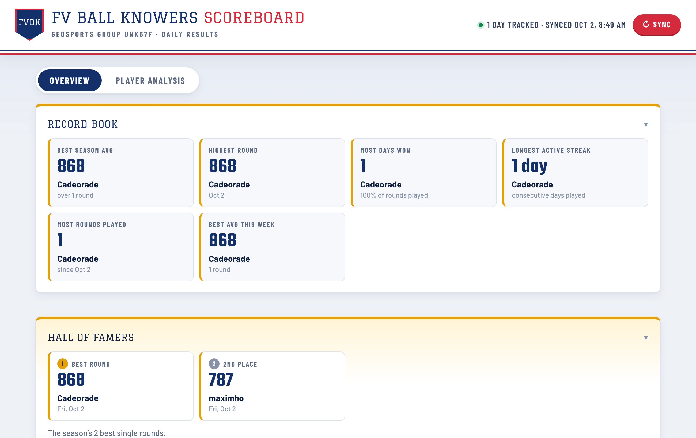
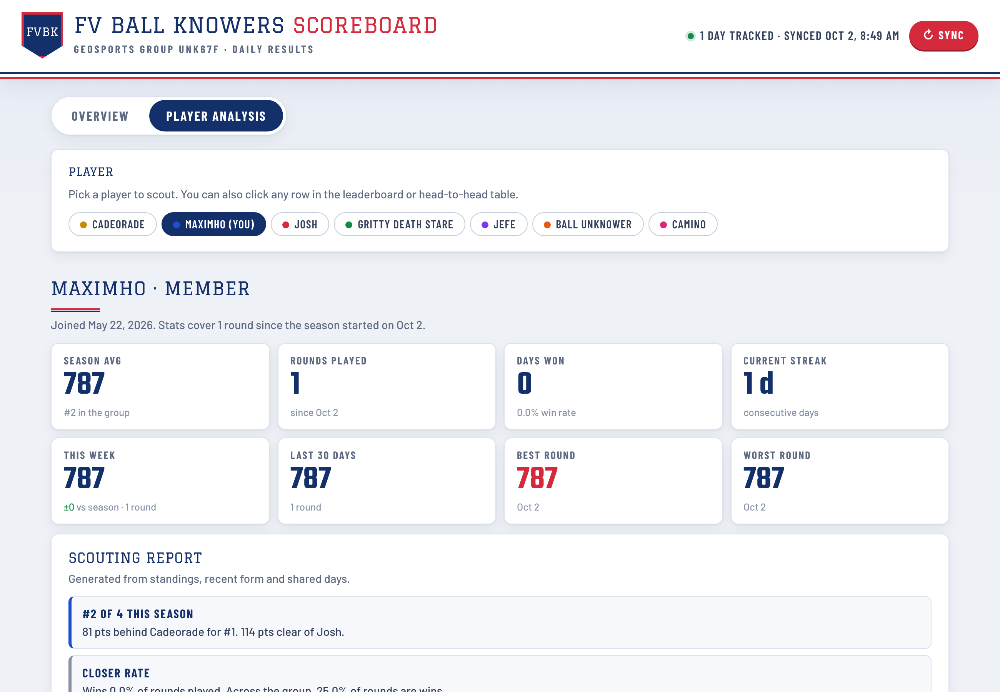
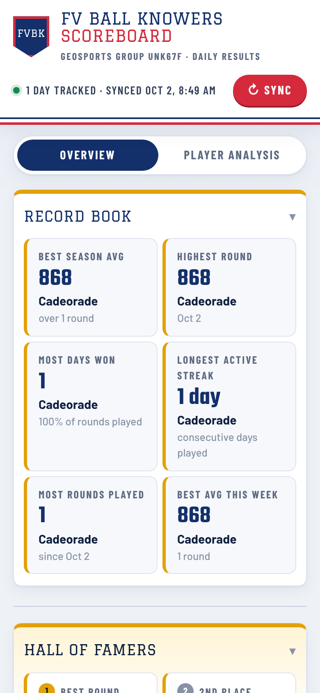

# FV Ball Knowers Scoreboard

A live scoreboard for my friends' daily [GeoSports](https://geosports.app) games. Our season starts on October 2, 2026, and every result from then on goes into a Google Sheet. This page turns the sheet into leaderboards, records, form charts and head-to-head scouting reports, all calculated from the season's scores. Update the sheet, reload the page, and the numbers change.

**▶ Live: [maximhoeft94.github.io/geosports-dashboard](https://maximhoeft94.github.io/geosports-dashboard/)**



## What it does

**Overview tab**
- Record Book (the executive summary): best season average, highest round, most days won, longest streak, most rounds played
- Hall of Famers and You're Benched!: the season's best and worst single rounds
- Season Totals: overall leader and lowest average, group average, 7-day leader, rounds tracked, and performance rate (rounds played out of every possible player-day)
- Leaderboard for today, this week, this month and the season, ranked by average like GeoSports does, with a 7-day trend line per player
- Daily scores chart (500 to 1,000 scale, hover any dot for the date and score) with player and date-range filters
- Days-won chart and an average-score chart ranked highest first
- Appendix with the full daily results table

**Player Analysis tab**
- Stat cards for any player: season average, rounds, days won, win rate, streak, this week vs. the season, best and worst rounds
- Scouting report: rank gaps, recent form, win rate vs. the group, consistency, best day of the week, nemesis and favorite matchup
- Score trend with a 5-round rolling average and the group's daily average
- Head-to-head record against every other player on days both played
- Score distribution



## How it works

```
GeoSports group ──(refresh)──▶ Google Sheet ──(CSV)──▶ index.html (Chart.js)
```

- **Data:** a view-only Google Sheet with four tabs. `Daily Scores` has one row per day and one column per player. `Players` is the group roster. `Info` holds the group name, the season start date and when the data was last refreshed. `Data Sources` records where each table came from.
- **Stats:** every average, win, streak and record is calculated in the browser from `Daily Scores`, counting only days from the season start on. Weeks run Monday to Sunday, and a tie for the day's top score counts as a win for each tied player.
- **Refreshing:** GeoSports shows every member's daily scores for the last 7 days. Each refresh adds new days to the sheet and updates the last 7, so late plays get picked up and older days are never overwritten. As long as a refresh happens at least once a week, no day is lost.
- **Page:** a single static `index.html` on GitHub Pages. It fetches each tab's CSV export straight from the browser and computes everything client-side, so there's no backend.

**Stack:** JavaScript · Chart.js · HTML/CSS · Google Sheets · GitHub Pages

## Run it locally

Open `index.html` in a browser, or serve the folder:

```bash
python3 -m http.server 8000
# open http://localhost:8000
```

To point it at a different sheet, change `SHEET_ID` in `index.html`. The sheet needs the `Daily Scores`, `Players` and `Info` tabs described above (`Info` needs a `Tracking starts` row) and must be shared as "Anyone with the link can view".



---
Built by Maxim Hoeft.
